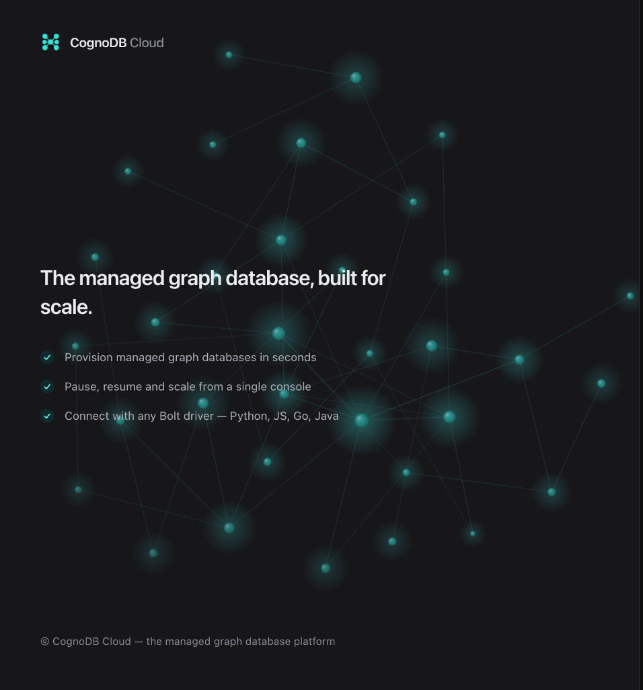
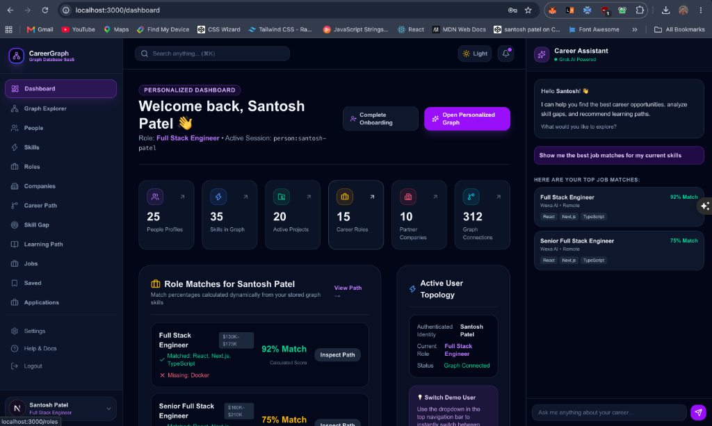
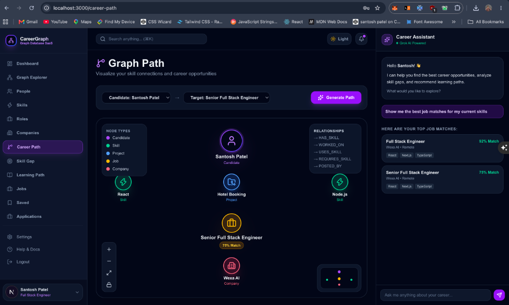
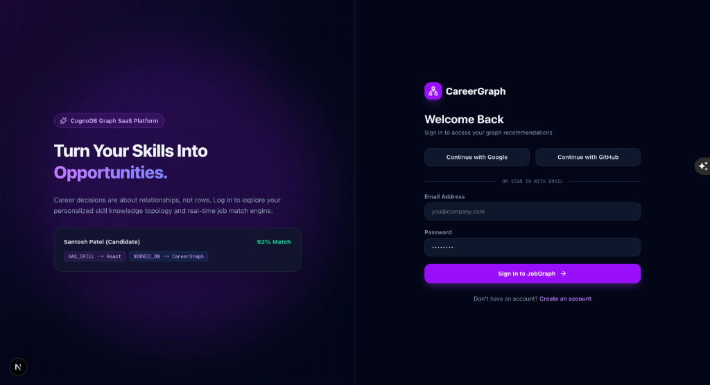
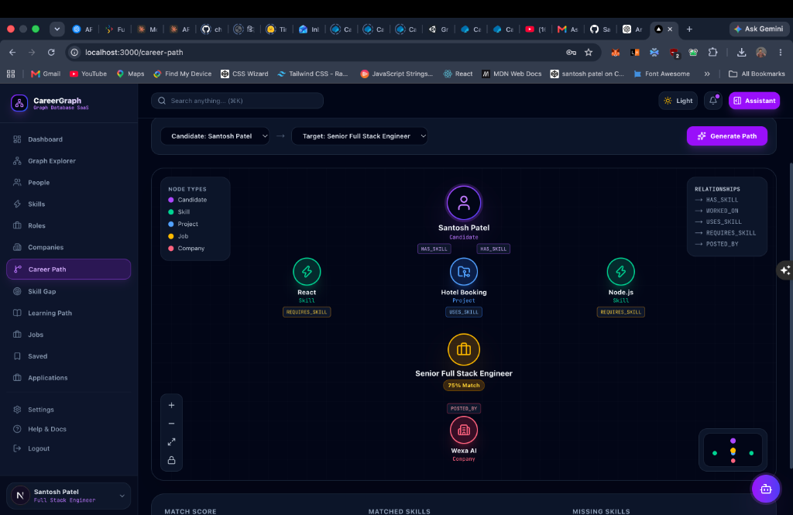

<div align="center">

# 🚀 CareerGraph

### *The AI-Powered Career Intelligence & Graph Platform*

**Turn Skills, Roles, and Opportunities into an Interactive Graph Network**

[](https://nextjs.org)
[](https://typescriptlang.org)
[](https://neo4j.com)
[](https://tailwindcss.com)
[](https://x.ai)

> *"Career decisions are about relationships, not rigid rows."*

[🌐 Live Demo](#-demo-credentials) · [✨ Features](#-key-features--walkthrough) · [📖 Tech Stack](#-architecture--tech-stack) · [🚀 Quick Start](#-getting-started)

</div>

---

## ⚡ Overview

**CareerGraph** is a full-stack, enterprise-ready **SaaS platform** designed to model, traverse, and analyze complex professional networks. By leveraging a **Graph Database (Neo4j)**, CareerGraph connects **Candidates**, **Skills**, **Projects**, **Roles**, **Companies**, and **Learning Resources** into a living network topology.

Unlike traditional SQL databases that rely on expensive recursive joins, CareerGraph uses **Cypher query traversals** to calculate skill gaps, candidate match scores, and career progression paths instantly.

---

## 📸 Key Features & Walkthrough

### 🏠 1. Landing & Landing Graph Visualizer
An immersive entry point with dynamic mouse-trailing background particle physics and live node connection visualizers.



- **Interactive Canvas**: Live ambient particle graph background responding to cursor motion.
- **Instant Authentication**: Quick demo access mode for seamless exploration.
- **Product Highlights**: Feature breakdown showcasing graph intelligence capabilities.

---

### 📊 2. Personalized Candidate Dashboard
A centralized command center offering dynamic match analytics, real-time KPI progress tracking, and AI-driven job recommendations.



- **Real-Time KPI Metrics**: Track total matched skills, target role readiness, and profile completeness.
- **Smart Recommendations**: Graph-based candidate-to-role matching with percentage accuracy scores.
- **Embedded Grok AI Assistant**: Chat with an AI career advisor contextually aware of your graph node profile.

---

### 🔮 3. Interactive Graph Explorer
Visualize your entire career network with an interactive node topology viewer powered by custom graph engines.



- **Neighborhood Traversal**: Expand nodes dynamically to inspect 1-hop and 2-hop connected relationships (`Candidate → HAS_SKILL → Skill ← REQUIRES_SKILL ← Role`).
- **Interactive Inspection**: Click on any node (Person, Skill, Role, Company, Project) to view details in the Inspector side panel.
- **Visual Node Types**: Distinct color-coded nodes with animated directional relationship edges.

---

### 🛣️ 4. Dynamic Career Path Visualizer
A dedicated graph pathfinder that computes traversal paths between candidate skills and target career roles.



- **Traversals**: Visualizes exact paths connecting candidate experience with required job requirements.
- **Skill Gap Identification**: Highlights owned skills vs missing skill gaps required for role progression.
- **Company & Job Linking**: Direct connection lines displaying companies offering matched positions.

---

### 🛡️ 5. Admin Command & Analytics Control Center
An enterprise admin control room built for managing graph topology, system metrics, and user roles.



- **Live Database Analytics**: Monitor active Neo4j node counts, relationship density, and query performance.
- **User & Job Management**: Full management capabilities for user records, posted roles, and graph attributes.
- **RBAC Security**: Role-based access protection distinguishing standard Candidate users from System Admins.

---

## 🔑 Demo Credentials

Explore all user & admin features instantly without signing up:

| Role | Email | Password | Access Rights |
|---|---|---|---|
| 👤 **User (Candidate)** | `santoshpatelvns5@gmail.com` | `santosh123456789#` | Full Candidate Dashboard, Graph Explorer, Career Pathing |
| 🛡️ **Admin** | `careergraph@gmail.com` | `admin` | Full Admin Dashboard, Analytics, User Management |

---

## 💡 Why a Graph Database over SQL?

In a traditional relational database (SQL), running multi-dimensional career queries requires complex, multi-table `JOIN` statements that scale poorly:

```sql
-- ❌ SQL: Requires 5+ Expensive JOINs
SELECT p.name, r.title, c.name, s.name
FROM people p
JOIN person_skills ps ON p.id = ps.person_id
JOIN skills s ON ps.skill_id = s.id
JOIN role_skills rs ON s.id = rs.skill_id
JOIN roles r ON rs.role_id = r.id
JOIN companies c ON r.company_id = c.id
WHERE p.id = 'candidate-1';
```

With **Neo4j Cypher**, graph traversals follow pointers directly with zero join overhead:

```cypher
// ✅ Neo4j Cypher: Fast & Natural Traversal
MATCH (p:Person {id: $personId})-[:HAS_SKILL]->(s:Skill)<-[:REQUIRES_SKILL]-(r:Role)-[:POSTED_BY]->(c:Company)
RETURN p, s, r, c;
```

---

## 🛠️ Tech Stack & Architecture

```
                                ┌──────────────────────────────┐
                                │   Next.js 15 (App Router)    │
                                └──────────────┬───────────────┘
                                               │
                       ┌───────────────────────┴───────────────────────┐
                       ▼                                               ▼
        ┌─────────────────────────────┐                 ┌─────────────────────────────┐
        │  Tailwind CSS & Lucide UI   │                 │      Authentication         │
        └─────────────────────────────┘                 └─────────────────────────────┘
                       │                                               │
                       └───────────────────────┬───────────────────────┘
                                               ▼
                                 ┌───────────────────────────┐
                                 │   Next.js API Handlers    │
                                 └─────────────┬─────────────┘
                                               │
                       ┌───────────────────────┴───────────────────────┐
                       ▼                                               ▼
        ┌─────────────────────────────┐                 ┌─────────────────────────────┐
        │   Neo4j Graph Database      │                 │      xAI / Grok API         │
        │    (Cypher Engine)          │                 │     (AI Chatbot Engine)     │
        └─────────────────────────────┘                 └─────────────────────────────┘
```

- **Framework**: Next.js 15 (App Router, Server Actions, API Routes)
- **Language**: TypeScript (Strict Mode)
- **Database**: Neo4j (Graph Database with Cypher)
- **Styling**: Tailwind CSS + Custom Dark Glassmorphism Design
- **Icons & UI**: Lucide React + Custom SVG Canvas Renderers
- **AI Intelligence**: xAI Grok API Integration
- **State & Utilities**: React Context, Zod Schema Validation

---

## 🚀 Getting Started

### 1. Prerequisites
- Node.js >= 18.x
- Neo4j Instance (Local Desktop or Neo4j Aura Cloud)

### 2. Installation
```bash
# Clone the repository
git clone https://github.com/Santoshpatel112/WexaAi-Assignment-2.git

# Navigate into project directory
cd career-graph

# Install dependencies
npm install
```

### 3. Environment Setup
Create a `.env` file in the root directory:

```env
# Neo4j Database Configuration
NEO4J_URI=bolt://localhost:7687
NEO4J_USERNAME=neo4j
NEO4J_PASSWORD=your_password
NEO4J_DATABASE=neo4j

# AI Integration
GROK_API_KEY=your_grok_api_key

# App URL
NEXT_PUBLIC_APP_URL=http://localhost:3000
```

### 4. Seed Database
```bash
# Populate Neo4j with initial Graph Nodes (People, Skills, Roles, Companies)
npm run db:seed
```

### 5. Run Development Server
```bash
npm run dev
```
Open [http://localhost:3000](http://localhost:3000) in your browser.

---

## 🧪 Verification & Build Commands

```bash
# Run TypeScript Type Check
npm run typecheck

# Run Production Build Test
npm run build
```

---

<div align="center">

Crafted with ❤️ by **Santosh Patel**

</div>
