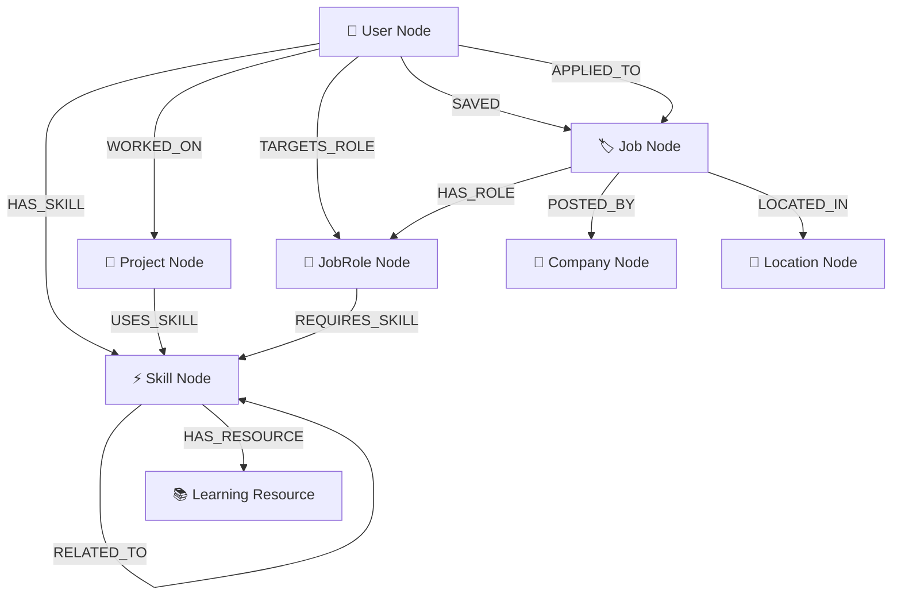

<div align="center">

# 🚀 CareerGraph

### *The AI-Powered Career Intelligence Platform*

**Turn Your Skills Into Opportunities Through an Intelligent Graph Database**

[](https://nextjs.org)
[](https://typescriptlang.org)
[](https://cognodb.com)
[](https://clerk.com)
[](https://x.ai)

> *"Career decisions are about relationships, not rows."*

[🌐 Live Demo](#-demo-credentials) · [📖 Docs](#️-architecture) · [🚀 Quick Start](#-setup--local-development)

</div>

---

## 📸 Screenshots

<table>
  <tr>
    <td align="center" width="50%">
      
      <br/>
      <strong>🏠 Home Page</strong> — Interactive mouse cursor graph background with live node connections
    </td>
    <td align="center" width="50%">
      
      <br/>
      <strong>📊 Personalized Dashboard</strong> — Dynamic role matches, KPI metrics & Grok AI assistant
    </td>
  </tr>
  <tr>
    <td align="center" width="50%">
      
      <br/>
      <strong>🔮 Graph Explorer</strong> — Interactive Neo4j graph topology with expandable neighborhoods
    </td>
    <td align="center" width="50%">
      
      <br/>
      <strong>🛣️ Career Path</strong> — Dynamic skill-to-role graph traversal with match scoring
    </td>
  </tr>
  <tr>
    <td align="center" width="50%">
      
      <br/>
      <strong>🛡️ Admin Dashboard</strong> — RBAC-protected system analytics with live Neo4j metrics
    </td>
    <td align="center" width="50%">
      
      <br/>
      <strong>🔑 Demo Credentials</strong> — Quick login preview badge on landing page
    </td>
  </tr>
</table>

---

## 🌟 What is CareerGraph?

CareerGraph is a full-stack, production-grade **SaaS platform** that models the complex network of relationships between **People**, **Skills**, **Projects**, **Roles**, **Companies**, and **Learning Resources** using a **graph database**.

Powered by **Neo4j / CognoDB** (openCypher over Bolt), it unlocks answers to multi-hop career questions that are inherently slow and awkward in relational SQL databases.

---

## ✨ Key Features

| Feature | Description |
|---|---|
| 🎨 **Interactive Graph Explorer** | Dark-mode graph visualization with custom node card identities, match badges, glowing edge traversals, and live neighborhood expansion |
| 📊 **Personalized Dashboard** | Real-time KPI metrics, role matching scores, and skill gap analysis driven by your graph profile |
| 🛣️ **Career Path Generator** | Calculates shortest skill-traversal paths between owned skills and target role requirements |
| 🤖 **Grok AI Career Assistant** | Personalized career chatbot backed by xAI / Grok with live Neo4j graph context |
| 🔍 **Multi-hop Cypher Queries** | 4-hop relationship traversals (`Candidate → HAS_SKILL → Skill ← REQUIRES_SKILL ← Role`) |
| 🛡️ **Clerk Authentication** | Secure sign-up, sign-in, session management, and RBAC with USER and ADMIN roles |
| 🗂️ **Admin Control Center** | RBAC-protected admin dashboard with live database analytics and user/job management |
| 📱 **Fully Responsive** | Works across desktop, tablet, and mobile with a premium dark SaaS design |

---

## 🔑 Demo Credentials

> Try the application instantly — no sign-up required:

| Role | Email | Password |
|---|---|---|
| 👤 **USER** | `santoshpatelvns5@gmail.com` | `santosh123456789#` |
| 🛡️ **ADMIN** | `careergraph@gmail.com` | `admin` |

---

## 💡 Why a Graph Database? (CognoDB vs. SQL)

In a traditional relational database, answering:
> *"Find target roles that match a candidate's skills, show the projects demonstrating those skills, identify missing skills, and list companies offering those roles"*

requires joining **7+ tables** with recursive JOINs that degrade exponentially at scale.

### ❌ SQL — Awkward & Slow
```sql
SELECT p.name, r.title, c.name, s.name
FROM people p
JOIN person_skills ps ON p.id = ps.person_id
JOIN skills s ON ps.skill_id = s.id
JOIN role_skills rs ON s.id = rs.skill_id
JOIN roles r ON rs.role_id = r.id
JOIN companies c ON r.company_id = c.id
WHERE p.id = 'santosh-patel'; -- 5+ expensive JOINs
```

### ✅ CognoDB openCypher — Natural & Fast
```cypher
MATCH (p:Person {id: $personId})-[:HAS_SKILL]->(s:Skill)<-[:REQUIRES_SKILL]-(r:Role)-[:OFFERED_BY]->(c:Company)
RETURN p, s, r, c;
```

---

## 📐 Graph Data Model



---

## 🏗️ Architecture

```
Browser (Next.js 16 App Router)
          │
          ▼
Clerk Authentication (clerkMiddleware)
          │
          ▼
Next.js Route Handlers (API Layer)
          │
    ┌─────┴──────┐
    ▼             ▼
Zod Validation   Auth Guard
    │
    ▼
Service Layer
    │
    ▼
Repository Layer (Cypher Queries)
    │
    ▼
Neo4j JS Driver Singleton (Connection Pool)
    │
    ▼
CognoDB Managed Cloud (Bolt Protocol)
```

### Tech Stack

| Layer | Technology |
|---|---|
| **Frontend** | Next.js 16, TypeScript, Tailwind CSS, shadcn/ui, Aceternity UI |
| **Animations** | Framer Motion, CSS micro-animations |
| **Auth** | Clerk (`@clerk/nextjs`) |
| **Database** | Neo4j Aura / CognoDB (openCypher via Bolt) |
| **AI** | Grok / xAI (`grok-2-latest`) |
| **Graph Viz** | React Flow with custom node renderers |
| **Validation** | Zod |

---

## 🚀 Setup & Local Development

### 1. Prerequisites
- Node.js >= 18.x
- A CognoDB Cloud or Neo4j Aura instance
- A Clerk account (free tier works)
- A Grok / xAI API key

### 2. Clone & Install
```bash
git clone https://github.com/your-username/career-graph.git
cd career-graph
npm install
```

### 3. Configure Environment Variables
```bash
cp .env.example .env
```

Edit `.env` with your credentials:
```env
# Neo4j / CognoDB
NEO4J_URI=bolt+s://<instance-id>.databases.cognodb.cloud
NEO4J_USERNAME=cognodb
NEO4J_PASSWORD=<your-generated-password>
NEO4J_DATABASE=neo4j

# Clerk Authentication
NEXT_PUBLIC_CLERK_PUBLISHABLE_KEY=pk_test_...
CLERK_SECRET_KEY=sk_test_...

# Grok AI
GROK_API_KEY=gsk_...

# App
NEXT_PUBLIC_APP_URL=http://localhost:3000
```

### 4. Seed the Database
```bash
npm run db:seed
```
Populates **25+ people**, **35+ skills**, **20+ projects**, **15+ roles**, **10+ companies**, **20+ learning resources**, and **300+ relationships**.

### 5. Run Development Server
```bash
npm run dev
```
Open [http://localhost:3000](http://localhost:3000) in your browser.

---

## 🧪 Verification

```bash
# TypeScript strict typecheck (0 errors)
npm run typecheck

# Lint check
npm run lint

# Production build validation (all 25 routes)
npm run build
```

---

## 🛡️ Admin Dashboard

Access `/admin` with the admin account to view:
- **System Analytics** — Live Neo4j node/relationship counts
- **User Management** — RBAC role assignment (USER/ADMIN)
- **Job Postings** — Create/edit/delete job nodes linked to skill graphs
- **Graph Analytics** — Node centrality metrics and popular skill heatmaps

---

## 📁 Project Structure

```
src/
├── app/                    # Next.js App Router pages
│   ├── api/               # Server-side API routes
│   │   ├── career-path/   # Career path calculation
│   │   ├── chat/          # Grok AI assistant
│   │   ├── graph/         # Graph data & expansion
│   │   ├── recommendations/ # Job matching engine
│   │   └── admin/         # Admin analytics APIs
│   ├── dashboard/         # Personalized user dashboard
│   ├── graph/             # Interactive graph explorer
│   ├── career-path/       # Career path visualizer
│   ├── skill-gap/         # Skill gap analysis
│   ├── admin/             # Admin control center
│   ├── login/             # Clerk sign-in page
│   └── signup/            # Clerk sign-up page
├── components/
│   ├── layout/            # AppShell (sidebar + header + chatbot)
│   └── ui/                # Reusable UI components
├── server/
│   ├── db/                # Neo4j driver & mock data
│   ├── services/          # Business logic
│   ├── repositories/      # Cypher query layer
│   └── validators/        # Zod schemas
├── lib/                   # Auth context, utilities
└── types/                 # TypeScript interfaces
```

---

## 🙌 Built With

- [Next.js](https://nextjs.org) — React framework
- [CognoDB / Neo4j](https://cognodb.com) — Graph database
- [Clerk](https://clerk.com) — Authentication
- [xAI / Grok](https://x.ai) — AI career assistant
- [shadcn/ui](https://ui.shadcn.com) — UI components
- [Aceternity UI](https://ui.aceternity.com) — Premium effects
- [Framer Motion](https://www.framer.com/motion) — Animations
- [React Flow](https://reactflow.dev) — Graph visualization

---

<div align="center">

Made with ❤️ by **Santosh Patel**

*WEXA AI CognoDB Take-Home Assignment*

</div>
