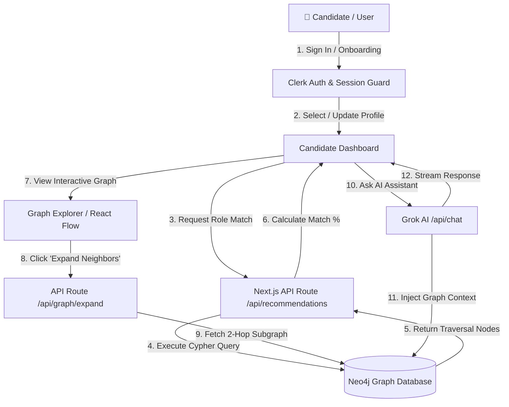
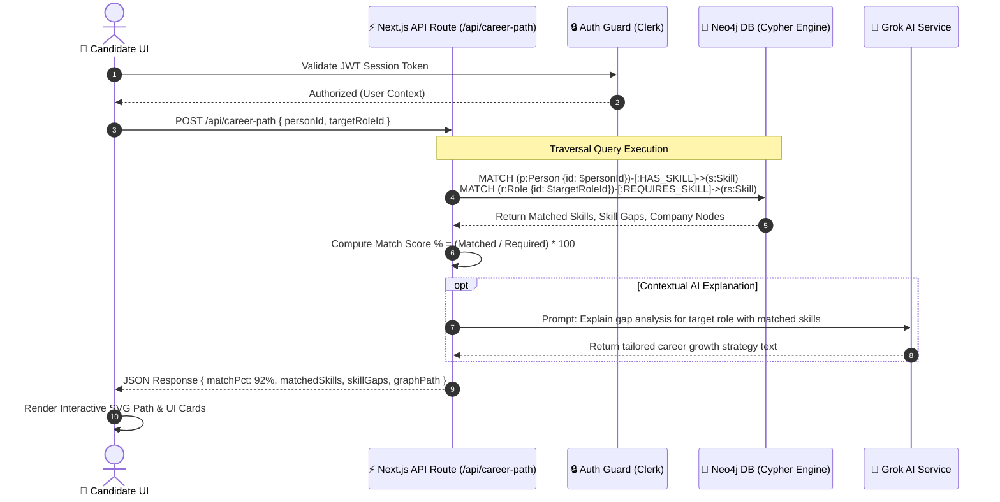

<div align="center">

# 🚀 CareerGraph

### *The AI-Powered Career Intelligence & Graph Intelligence SaaS*

**Transform Skills, Roles, and Opportunities into an Interactive Graph Network**

[](https://nextjs.org)
[](https://typescriptlang.org)
[](https://neo4j.com)
[](https://tailwindcss.com)
[](https://x.ai)

> *"Career decisions are about relationships, not rigid rows."*

[🌐 Live Demo](#-demo-credentials) · [✨ Feature Walkthrough](#-feature-wise-walkthrough) · [🔄 Workflow & Sequence Diagrams](#-workflow--sequence-diagrams) · [📖 Tech Architecture](#-architecture--data-flow) · [🚀 Quick Start](#-getting-started)

</div>

---

## ⚡ Executive Summary

**CareerGraph** is a full-stack, enterprise-grade **Graph Database SaaS Platform** built to model, analyze, and visualize complex professional career ecosystems. Connecting **Candidates**, **Skills**, **Projects**, **Roles**, **Companies**, and **Learning Resources** into a single living graph network, it enables multi-hop relationship traversals impossible with traditional relational databases.

Powered by **Neo4j** (openCypher via Bolt protocol), **Next.js 16 (Turbopack)**, **Tailwind CSS**, and **xAI Grok AI**, CareerGraph calculates real-time candidate-to-role match percentages, skill gap traversals, and automated career path recommendations.

---

## 📸 Feature-Wise Walkthrough

### 🏠 1. Landing Page & Live Node Topology
An immersive, interactive dark-mode landing page featuring an ambient particle canvas that reacts dynamically to mouse cursor motion.


#### Highlights & Capabilities:
- **Interactive Mouse Canvas**: Real-time particle connection visualizer representing skill node relationships.
- **One-Click Demo Access**: Direct sign-in shortcuts for candidate and admin profiles without registration friction.
- **Live Match Preview**: Interactive node status tickers displaying target role match percentages.

---

### 📊 2. Personalized Candidate Dashboard
A comprehensive command center summarizing the candidate's career standing, active node topology, skill match distributions, and AI assistant actions.


#### Highlights & Capabilities:
- **Real-Time KPI Cards**: Dynamic counters for People Profiles (25+), Skills in Graph (35+), Active Projects (20+), Career Roles (15+), Partner Companies (10+), and Graph Connections (312+).
- **Dynamic Role Matcher**: Instant calculation of candidate match percentages (e.g., **92% Match for Full Stack Engineer**, **75% Match for Senior Full Stack Engineer**).
- **Active Topology Widget**: Quick identity switcher between Candidate profiles (`santosh patel`, `Sarah Chen`, etc.) to demonstrate dynamic graph reactivity.

---

### 🔮 3. Interactive Graph Explorer
A powerful visual graph workspace allowing users to explore neighborhoods, expand node connections, inspect properties, and trigger multi-hop Cypher queries.


#### Highlights & Capabilities:
- **Node Neighborhood Expansion**: Expand connections on demand (`Candidate → HAS_SKILL → Skill ← REQUIRES_SKILL ← Role`).
- **Detailed Inspector Panel**: Sidebar displaying salary ranges (`$130K–$175K`), matched vs missing skills, and connected companies.
- **Custom Node Renderers**: Distinct visual identities for Candidate (Purple), Skill (Green), Project (Blue), Job (Amber), and Company (Rose) nodes.

---

### 🛣️ 4. Dynamic Career Path Visualizer
A dedicated graph pathfinder that computes visual traversal routes connecting candidate experience to target roles.


#### Highlights & Capabilities:
- **Skill Traversal Curves**: Curved vector arrows highlighting owned skills (`React`, `TypeScript`, `Next.js`) bridging candidate to role requirements.
- **Skill Gap Traversal**: Automated detection of missing skill nodes needed to achieve 100% role match.
- **Company Relationship Links**: Direct directional links connecting target roles to posting companies (`Wexa AI`).

---

### 🛡️ 5. Admin Analytics & System Control Center
An RBAC-protected administrative dashboard built for system monitoring, user management, and graph metric analytics.


#### Highlights & Capabilities:
- **Graph Health Metrics**: Real-time monitoring of database node counts, edge density, and Cypher query execution latency.
- **User & Role Administration**: Manage candidate profiles, assign RBAC permissions (USER / ADMIN), and create job postings.
- **Centrality Analytics**: Track most in-demand skills and company hiring trends across the platform.

---

## 🔄 Workflow & Sequence Diagrams

### 🗺️ 1. End-to-End System Workflow



---

### ⏱️ 2. Candidate Role Matching Sequence Diagram



---

## 🔑 Demo Credentials

Test all candidate and administrator capabilities instantly:

| Role | Email | Password | Target Dashboard |
|---|---|---|---|
| 👤 **User (Candidate)** | `santoshpatelvns5@gmail.com` | `santosh123456789#` | Candidate Dashboard & Graph Pathfinder |
| 🛡️ **Administrator** | `careergraph@gmail.com` | `admin` | Admin Control Center & Node Analytics |

---

## 💡 Why a Graph Database? (SQL vs. Neo4j Cypher)

In relational SQL databases, retrieving candidate skill matches, missing skills, and company job listings requires **5+ recursive JOINs** that slow down as database size grows:

### ❌ SQL Approach — Complex & Slow
```sql
SELECT p.name, r.title, c.name, s.name
FROM people p
JOIN person_skills ps ON p.id = ps.person_id
JOIN skills s ON ps.skill_id = s.id
JOIN role_skills rs ON s.id = rs.skill_id
JOIN roles r ON rs.role_id = r.id
JOIN companies c ON r.company_id = c.id
WHERE p.id = 'person:santosh-patel';
```

### ✅ Neo4j openCypher — Intuitive & High Performance
```cypher
MATCH (p:Person {id: $personId})-[:HAS_SKILL]->(s:Skill)<-[:REQUIRES_SKILL]-(r:Role)-[:POSTED_BY]->(c:Company)
RETURN p.name, s.name, r.title, c.name;
```

---

## 🛠️ Architecture & Tech Stack

```
                          ┌─────────────────────────────────────────┐
                          │   Frontend UI Layer                     │
                          │   Next.js 16 (App Router) + Tailwind    │
                          └────────────────────┬────────────────────┘
                                               │
                                               ▼
                          ┌─────────────────────────────────────────┐
                          │   Middleware & Auth Guard               │
                          │   Clerk Auth & Session Handler          │
                          └────────────────────┬────────────────────┘
                                               │
                                               ▼
                          ┌─────────────────────────────────────────┐
                          │   API Router / Controller Layer         │
                          │   /api/graph, /api/career-path, /api/chat │
                          └──────────┬───────────────────┬──────────┘
                                     │                   │
                                     ▼                   ▼
           ┌───────────────────────────────────┐  ┌───────────────────────────────────┐
           │ Graph Database Repository Layer   │  │ AI Integration Engine             │
           │ Neo4j Driver (openCypher via Bolt)│  │ xAI / Grok-2 API                  │
           └───────────────────────────────────┘  └───────────────────────────────────┘
```

- **Frontend**: Next.js 16 (Turbopack), React 19, TypeScript (Strict Mode)
- **Styling**: Tailwind CSS v4, Glassmorphism UI, Aceternity UI Effects
- **Database**: Neo4j (Graph Database with Cypher Query Language)
- **Graph Visualization**: React Flow (`@xyflow/react`) + Custom SVG Renderers
- **Authentication**: Clerk Authentication (`@clerk/nextjs`)
- **AI Intelligence**: xAI Grok API Integration
- **Validation**: Zod Schema Validation

---

## 🚀 Getting Started

### 1. Clone & Install
```bash
git clone https://github.com/Santoshpatel112/WexaAi-Assignment-2.git
cd career-graph
npm install
```

### 2. Environment Configuration
Create a `.env` file in the root directory:

```env
# Neo4j Database
NEO4J_URI=bolt://localhost:7687
NEO4J_USERNAME=neo4j
NEO4J_PASSWORD=your_password
NEO4J_DATABASE=neo4j

# Authentication (Clerk)
NEXT_PUBLIC_CLERK_PUBLISHABLE_KEY=pk_test_...
CLERK_SECRET_KEY=sk_test_...

# Grok AI
GROK_API_KEY=gsk_...

# App
NEXT_PUBLIC_APP_URL=http://localhost:3000
```

### 3. Seed Graph Database
```bash
npm run db:seed
```

### 4. Run Development Server
```bash
npm run dev
```
Open [http://localhost:3000](http://localhost:3000) in your browser.

---

## 🧪 Verification & Build

```bash
# TypeScript Type Check
npm run typecheck

# Lint Check
npm run lint

# Production Build
npm run build
```

---

<div align="center">

Crafted with ❤️ by **Santosh Patel**

</div>
