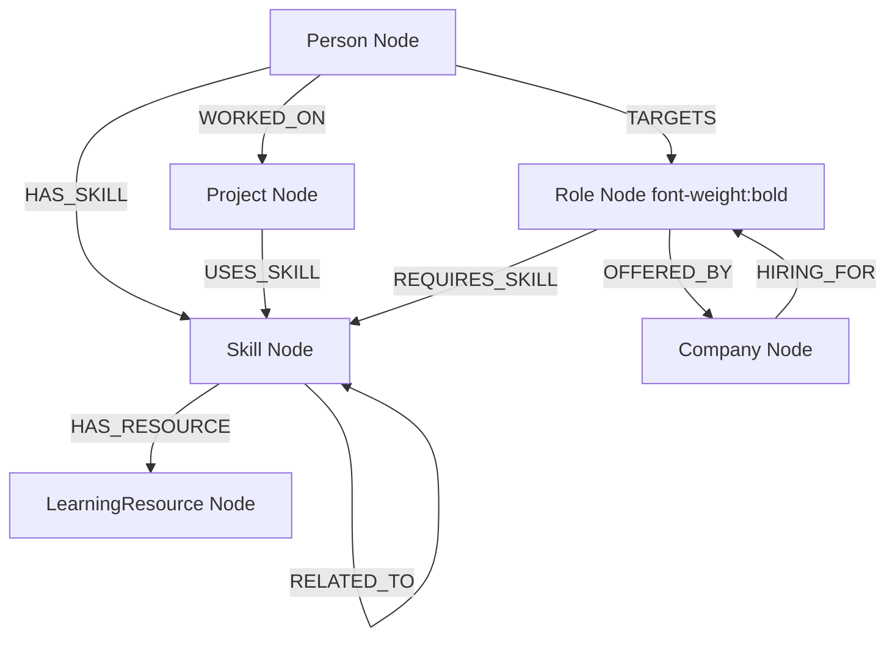

# CareerGraph — Graph Data Model Documentation

## Node Types

- **Person**: `id`, `name`, `email`, `title`, `location`, `experienceYears`, `bio`, `createdAt`
- **Skill**: `id`, `name`, `category`, `difficulty`, `description`
- **Project**: `id`, `name`, `description`, `category`, `githubUrl`, `demoUrl`, `year`
- **Role**: `id`, `title`, `description`, `level`, `salaryRange`
- **Company**: `id`, `name`, `industry`, `location`, `website`
- **LearningResource**: `id`, `title`, `type`, `url`, `provider`, `difficulty`

## Relationship Types

